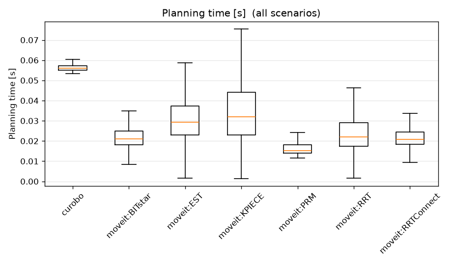

1. ODPALANIE:


BUILD: 
docker compose -f docker/docker-compose.yml build

RUN SIM: 
bash scripts/run_simulation.sh


RUN ALL SIMULATIONS FROM config/planners.yaml and gerneate metrics raport: 
bash scripts/run_harness.sh

1. generates the start/end points over given maps and number validating them in moveit
2. runs moveit pathplaining 
3. runs curobot pathplaning 
4. generates plots from genreated metrics (.csv)


## Architecture in one picture
```
scenario YAML ─► Adapter.plan() ─► PlanResult{trajectory} ─► results/raw/*.json
                  (per-framework)                              │
                                         metrics.py (ONE path) ─► metrics.csv ─► analysis ─► report
```
Adapters produce only trajectories; metrics are computed once, downstream, identically
for every planner. This is the core fairness invariant — preserve it.


GENERATE raport from data only: 
.venv/bin/activate
 mb-benchmark report --raw results/raw --scenarios scenarios/generated --no-autogen --out results/report

TO JUST RUN ros/curobo dockres:
docker compose -f docker/docker-compose.yml run --rm ros bash
docker compose -f docker/docker-compose.yml run --rm curobo bash


REMOVE CURRENT RESULTS:
rm -rf results/ scenarios/generated/ benchmark/*.egg-info benchmark/build


2.TODO KACPER  [- Konfiguracja, uruchomienie i przetestowanie wybranych algorytmów za pomocą modułu moveit_ros_benchmarks
] reczne testowanie: 
https://moveit.picknik.ai/humble/doc/examples/benchmarking/benchmarking_tutorial.html
https://moveit.picknik.ai/main/doc/how_to_guides/benchmarking/benchmarking_tutorial.html

odpalenie  RUN SIM stworzenie jakiejs losowej mapy chyba ze sie da z yamly z scenarios/libarary 
mocniej opisane jest w testowanie_wybranych_moveit_benchmark.md (wyszukaj: TODO Jeżeli chcemy tylko ze bylo odpaleone ale bez grafow co i tak bd imo okey )

Tak czy siak bym dal grafy ktore on generuje moveit ale nie musza byc te same mapy tylko ogolnie mysle  


Planery ktore zostały przetestowane: 

harness:
  moveit:           
    - moveit:RRTConnect
    - moveit:RRT
    - moveit:RRTstar
    - moveit:PRM
    - moveit:BITstar
    - moveit:EST
    - moveit:KPIECE
  curobo:          
    - curobo
  baselines:       
    - straightline

 zostal odpalony 
 po 10 razy (roznych startow i koncow) z maksymalnym czasem planowania 10s oraz po 3 proby na kazda z nich 


TODO opisac w skrocie jak dziala straightline oraz curobo 


 Rezulataty tych porownan: 





# Methodology

## Fair cross-framework comparison (Pipeline B)

1. **Identical problems.** One scenario library (`scenarios/library/*.yaml`) defines the
   world; one seeded generator (`generation.py`) produces collision-free start/goal
   queries. Same seed → identical queries for every planner and both pipelines.
2. **Natural goals, same target.** Each query stores a `goal_joint` *and* its FK
   `goal_pose`. A joint-space planner (OMPL) uses the joint goal; a pose-space planner
   (cuRobo) uses the pose — both reach the same configuration.
3. **Adapters emit only trajectories.** No planner scores itself. All metrics are computed
   afterwards by `metrics.py` from the trajectory + the (shared) world + a common robot
   model. This removes per-framework measurement bias.
4. **Warmup excluded.** Planners with `requires_warmup` (cuRobo: CUDA-graph/JIT) get one
   throwaway plan that is run but not recorded (`runner.py`).
5. **Repetitions.** Each (scenario, query) is planned `runs` times; randomness in the
   planners shows up as spread in the plots.

## Metric definitions (`metrics.py`)

Let a trajectory be joint waypoints `q_0 … q_N`. Distances are Euclidean in joint space
unless noted. EE position `p(q)` comes from analytic UR FK.

- **success** — planner reported a valid solution within `timeout`.
- **planning_time_s** — wall-clock around the `plan()` call (steady-state; warmup excluded).
- **solve_time_s** — time to first valid solution (≤ planning_time_s).
- **joint_path_length** — `Σ ‖q_{i+1} − q_i‖₂` (rad).
- **cartesian_path_length** — `Σ ‖p(q_{i+1}) − p(q_i)‖₂` (m).
- **smoothness_geom** — OMPL `PathGeometric::smoothness`: for each interior vertex with
  adjacent segment lengths `a, b` and chord `c`, turning angle `θ = π − acos((a²+b²−c²)/2ab)`,
  contribution `(2θ/(a+b))²`, summed. **0 = perfectly straight; larger = more jagged.**
  (Same definition MoveIt/OMPL uses, so it’s comparable to Pipeline A’s smoothness.)
- **smoothness_jerk** — normalized integrated squared jerk (only if per-waypoint timing is
  present; resampled to a uniform grid, 3× finite-differenced). Optional/secondary.
- **clearance** — minimum, over a densified path (≤ 0.1 rad steps), of the distance from
  the arm’s collision spheres to the nearest obstacle surface (m). Higher = safer;
  `+inf` when a scenario has no obstacles; `< 0` = penetration.
- **num_waypoints**, **path_valid** (no densified config penetrates an obstacle).

### Collision model used by the metric layer
A self-contained analytic model: UR DH forward kinematics + a coarse sphere
approximation of the moving arm (the static base column is excluded so it never reads as
colliding with the floor it’s mounted on). It’s deliberately dependency-free (numpy only)
so metrics run offline. It is a **relative** clearance model, not a certified collision
checker. For certified geometry, swap in pinocchio + hpp-fcl against the real meshes —
`metrics.py` is agnostic to the model behind the `RobotModel` interface.

### A note on what “planning time” and “path length” mean across frameworks
OMPL planners output a *geometric* path (then time-parameterized); cuRobo outputs an
*optimized, time-parameterized* trajectory. We report planning time to first valid
solution and compute all geometric metrics by one code path after a common densification.
This is the standard, defensible comparison; the difference in planner *philosophy*
(sampling vs optimization) is part of what the benchmark reveals, not a bias to hide.

## Design decisions (defaults + rationale)

| Decision | Default | Why |
|---|---|---|
| Delivery | Docker (multi-service) | Arch has no ROS 2 binaries; reproducible; isolates GPU |
| ROS distro | Jazzy | Mature MoveIt 2 + UR + benchmarks, **and** `moveit_py` ships as a binary (`ros-jazzy-moveit-py`) — Humble never released it (moveit/moveit2#3454), which would force a source build for the harness MoveIt adapter |
| Robot | **ur5e everywhere** | cuRobo ships a validated `ur5e.yml`; a hand-made, untestable ur5 sphere config would be a *silent* correctness bug. ur5e is a UR5-family arm. (Strict UR5 is a documented extension.) |
| Simulation | Mock hardware | Planning needs only a planning scene, not physics; deterministic & fast |
| MoveIt interface | `moveit_py` | In-process, any pipeline/planner, returns full trajectory; MoveGroup fallback documented |
| cuRobo | standalone `MotionGen` | No Isaac/ROS needed → clean, isolated adapter |
| Metric backend | analytic UR FK + sphere collision (numpy) | Offline-testable; uniform across planners |


# Jak dodac nowy planner (task 5)

Kontrakt: podklasa `PlannerAdapter`, ktora zwraca **tylko trajektorie**; metryki licza sie
downstream tak samo dla kazdego plannera (zasada fairness). Wzor: `adapters/template_adapter.py`.

Kroki:
1. Skopiuj `benchmark/mb_benchmark/adapters/template_adapter.py`
   -> `benchmark/mb_benchmark/adapters/<nazwa>_adapter.py`
2. Zaimplementuj:
   - `setup(robot_name, obstacles)` — zbuduj planner ze sceny. Ciezkie importy (ROS/torch)
     **TYLKO tutaj**, nie na poziomie modulu (offline core musi sie importowac bez ROS/GPU).
   - `plan(query, timeout, seed, run) -> PlanResult` z `trajectory` (lista pozycji w przestrzeni
     zlaczy); ustaw `time_from_start` jesli masz czasy; ustaw `requires_warmup = True` gdy GPU.
3. Na koncu pliku: `register("<nazwa>", lambda: <Twoj>Adapter())`
   (planery sparametryzowane, jak `moveit:`, rejestruje sie w petli — patrz `moveit_adapter.py:303`).
4. Dodaj import w `adapters/__init__.py`:  `from . import <nazwa>_adapter`
5. (opcjonalnie) dopisz nazwe do grupy w `config/planners.yaml` -> `harness:` (np. pod `baselines:`),
   zeby leciala przez `@group` w `scripts/run_harness.sh`.

Sprawdzenie:
```
mb-benchmark list-planners            # Twoj planner na liscie (+ grupy z YAML)
mb-benchmark run --planners <nazwa> --out results
mb-benchmark run --planners @baselines --out results   # albo cala grupa z YAML
```

Konwencje: kwaterniony `[x,y,z,w]` w naszym kodzie; cuRobo uzywa `[w,x,y,z]` (konwertuj na
granicy). Domyslnie ur5e / Jazzy / mock hardware.

## Skad biora sie runs / timeout / lista plannerow

Zrodlem prawdy jest `config/planners.yaml` (czyta go `mb_benchmark/config.py`).
Pierwszenstwo (od najwyzszego): jawne `--runs/--timeout/--planners` > `config/planners.yaml`
> wbudowany fallback (5 / 10.0).

W `scripts/run_harness.sh`: env `RUNS=`/`TIMEOUT=` sa przekazywane jako flagi tylko gdy ustawione,
inaczej CLI czyta YAML. Listy plannerow ida jako `@group` (`MOVEIT_PLANNERS=@moveit`,
`CUROBO_PLANNERS=@curobo`) i sa rozwijane z `harness:` w YAML. Nadpisanie na jedno uruchomienie:
```
RUNS=10 TIMEOUT=10 bash scripts/run_harness.sh
MOVEIT_PLANNERS=moveit:RRTConnect,moveit:RRT bash scripts/run_harness.sh
```