# Benchmark algorytmów planowania ruchu manipulatora UR5e


<h2>
Przedmiot: Metody i Algorytmy Planowanie Ruchu
</h2>

<h3>
Prowadzący: mgr inż. Bratosz Kulecki

Autor: inż. Julian Mikołajczak & inż Kacper Biadała</h3>


Porównanie planerów ruchu dla manipulatora **UR5e** w jednolitym, sprawiedliwym
środowisku testowym. Zestawiono planery próbkujące z MoveIt 2 (OMPL), planer
optymalizacyjny **cuRobo** (NVIDIA, GPU) oraz prostą linię odniesienia
(*straightline*). Wszystkie metryki liczone są **jednym kodem**, w ten sam sposób dla
każdego planera — to podstawowa zasada uczciwości porównania.


## Jak uruchomić

**Build:**
```bash
docker compose -f docker/docker-compose.yml build
```

**Uruchomienie symulacji (RViz + MoveIt):**
```bash
bash scripts/run_simulation.sh
```

**Pełny benchmark wg `config/planners.yaml` + wygenerowanie raportu z metryk:**
```bash
bash scripts/run_harness.sh
```

**Wygenerowanie raportu z istniejących danych:**
```bash
source .venv/bin/activate
mb-benchmark report --raw results/raw --scenarios scenarios/generated --no-autogen --out results/report
```

**Wejście do samych kontenerów ros / curobo:**
```bash
docker compose -f docker/docker-compose.yml run --rm ros bash
docker compose -f docker/docker-compose.yml run --rm curobo bash
```

**Wyczyszczenie wyników:**
```bash
rm -rf results/ scenarios/generated/ benchmark/*.egg-info benchmark/build
```


<div style="page-break-after: always;"></div>

## 1. Cel i zakres

Celem pracy jest zbudowanie powtarzalnego stanowiska benchmarkowego, które:

1. generuje **identyczne problemy planowania** (te same pary start/cel) dla wszystkich
   planerów na wspólnym zbiorze map,
2. uruchamia planery z różnych frameworków (MoveIt/OMPL, cuRobo) oraz baseline,
3. liczy **jednolite metryki** (czas, długość ścieżki, gładkość, prześwit, sukces) tym
   samym kodem dla każdego planera,
4. generuje wykresy porównawcze.

Prace rozpoczęto od **ręcznych** testów wybranych algorytmów OMPL natywnym modułem MoveIt
`moveit_ros_benchmarks`. Następnie zbudowano automatyczny,
międzyfreamworkowy harness, opisany w dalszej części raportu, który obejmuje
także planer cuRobo oraz baseline i liczy jednolite metryki.


## 2. Ręczne testy planerów w module `moveit_ros_benchmarks`

### 2.1. Przebieg ręcznego testu

Moduł `moveit_ros_benchmarks` jest natywną wtyczką MoveIt 2, sterowaną w całości z panelu
**MotionPlanning** w RViz. Scenę testową (przeszkody oraz pary stanów start/cel) buduje się
graficznie i zapisuje do magazynu **warehouse** (backend SQLite — Mongo nie jest pakowany
dla dystrybucji Jazzy/Humble), skąd `moveit_run_benchmark` odczytuje gotowy problem
planowania. Dzięki temu „które planery” i „które stany” są wyłącznie konfiguracją — nie
trzeba uruchamiać wszystkich algorytmów ani losowych zapytań.


W trakcie konfiguracji napotkano i naprawiono bug w `warehouse_ros_sqlite` 1.0.5 — brakująca
kolumna `M_planning_scene_id` w schemacie SQLite. Fix zastosowano w
`ros2_ws/src/warehouse_ros_sqlite/`.

Konfigurację wtyczki w RViz pokazuje poniższy zrzut — wybrana biblioteka planowania **OMPL**
oraz aktywne połączenie z magazynem warehouse (Host/Port w sekcji *Warehouse* — stan
*Connected* jest warunkiem zapisywania scen i stanów):

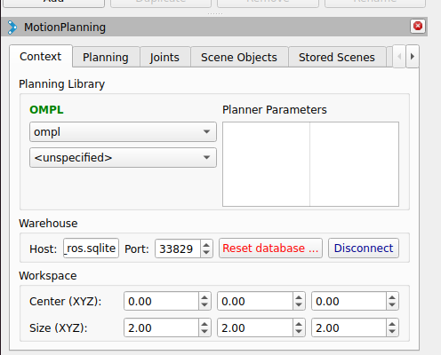

### 2.2. Przykładowe wyniki

Po uruchomieniu (`ros2 launch run_benchmark.launch.py`) moduł generuje pliki `.log`
z czasem planowania, długością ścieżki i statusem sukcesu dla każdego przebiegu. Logi
agreguje się skryptem `moveit_benchmark_statistics.py` do bazy `benchmark.db`, którą wczytuje
**Planner Arena**  i rysuje wykresy porównawcze — po jednej serii
na wybrany planer.

Poniżej przykładowy wynik — *Overall performance* dla atrybutu **time** (czas planowania,
box-plot per planer). Widać oczekiwany rozkład: planery feasible (RRTConnect, RRT, PRM)
rozwiązują problem w kilkanaście–trzydzieści milisekund, a tabela poniżej wykresu potwierdza
**0 brakujących przebiegów** (komplet rozwiązań) dla wszystkich czterech planerów:

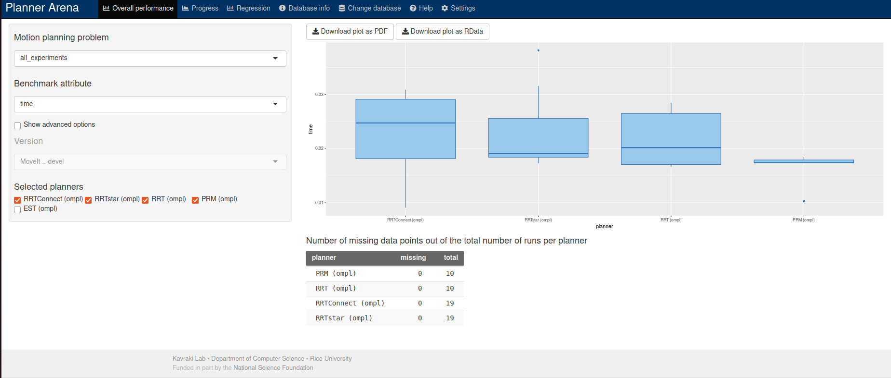

To potwierdza, że ręczny tor `moveit_ros_benchmarks` działa end-to-end: scena z RViz ->
warehouse -> `moveit_run_benchmark` -> logi -> Planner Arena. Pełna, samodzielna instrukcja
krok-po-kroku znajduje się w pliku `testowanie_wybranych_moveit_ros_benchmarks.md`.

---

## 3. Architektura potoku

Adaptery produkują **wyłącznie trajektorie**; żaden planer nie ocenia sam siebie. Metryki
liczone są raz, w dół potoku, identycznie dla każdego planera. To kluczowy niezmiennik
uczciwości porównania — eliminuje odchylenia pomiarowe specyficzne dla danego frameworka.

Potok uruchamiany jest skryptem `scripts/run_harness.sh`, który kolejno:

1. generuje pary start/cel na zadanych mapach i waliduje je w MoveIt,
2. uruchamia planowanie MoveIt,
3. uruchamia planowanie cuRobo,
4. generuje wykresy z zebranych metryk (`.csv`).


<div style="page-break-after: always;"></div>

## 4. Scenariusze (mapy testowe)

Świat definiuje jedna biblioteka scenariuszy (`scenarios/library/*.yaml`). Jeden,
zaziarniony generator (`generation.py`) tworzy bezkolizyjne zapytania start/cel — ten sam
seed daje **identyczne zapytania** dla każdego planera i obu potoków.

Przetestowano **6 map**: `cluttered`, `empty`, `narrow_passage`, `shelf`, `single_box`,
`table_pick`.

| Mapa | Opis | Co testuje |
|---|---|---|
| **empty** | Brak przeszkód (baseline). | Czysta prędkość/jakość planera; prześwit niezdefiniowany, każda bezkolizyjna prosta jest sukcesem. |
| **single_box** | Jedna ścianka-przeszkoda przed robotem + płyta podłogi/stołu. | Wymusza ominięcie; naiwna linia prosta często zawodzi, realne planery nie powinny. |
| **cluttered** | Mieszane bryły (boxy, walce, kula) rozrzucone w przestrzeni roboczej. | Ogólne unikanie bałaganu; różnice prześwitu i gładkości między planerami. |
| **narrow_passage** | Dwie wysokie ściany pozostawiające wąską pionową szczelinę. | Problem wąskiego przejścia — obciąża planery próbkujące, nagradza optymalizacyjne (cuRobo). |
| **shelf** | Dwupoziomowy regał przed robotem (półki + ścianki boczne). | Klasyczne wyzwanie sięgania „pick-from-shelf”. |
| **table_pick** | Blat stołu przed robotem z obiektem do chwytania na górze. | Kanoniczny scenariusz manipulacji na stole (tabletop). |


<table style="border: none;">
<tr style="border: none;">
<td align="center" style="border: none;">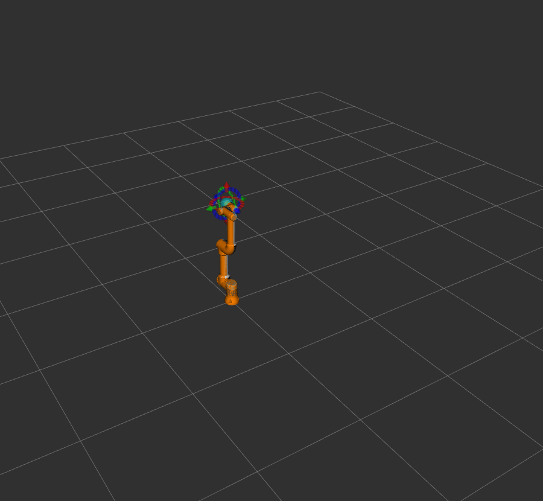</td>
<td align="center" style="border: none;">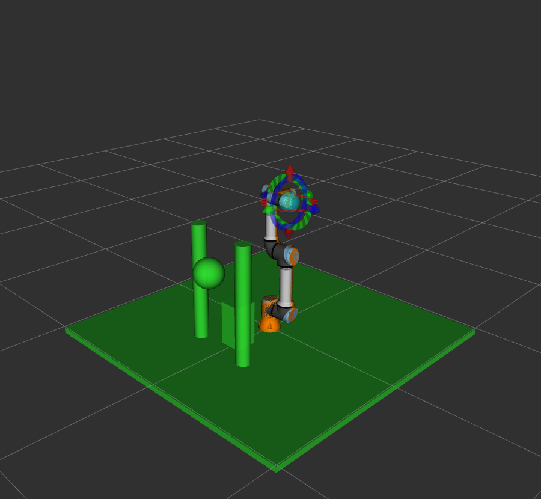</td>

<td align="center" style="border: none;">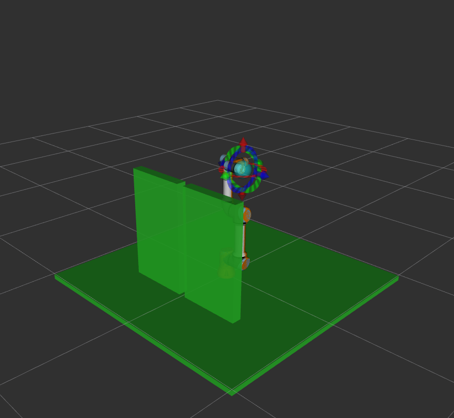</td>
</tr>
<tr style="border: none;">
<td align="center" style="border: none;"><b>empty</b></td>
<td align="center" style="border: none;"><b>cluttered</b></td>
<td align="center" style="border: none;"><b>narrow_passage</b></td>
</tr>
<tr style="border: none;">
<td align="center" style="border: none;">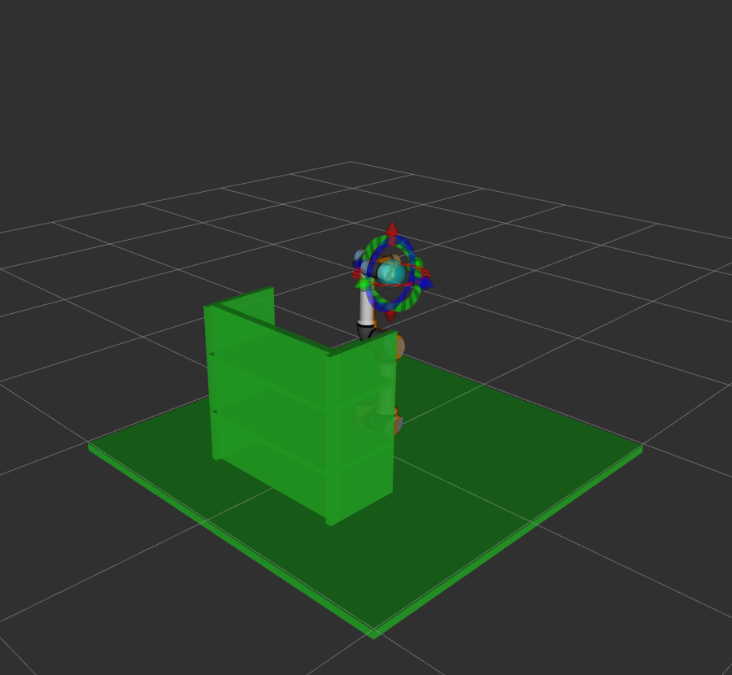</td>
<td align="center" style="border: none;">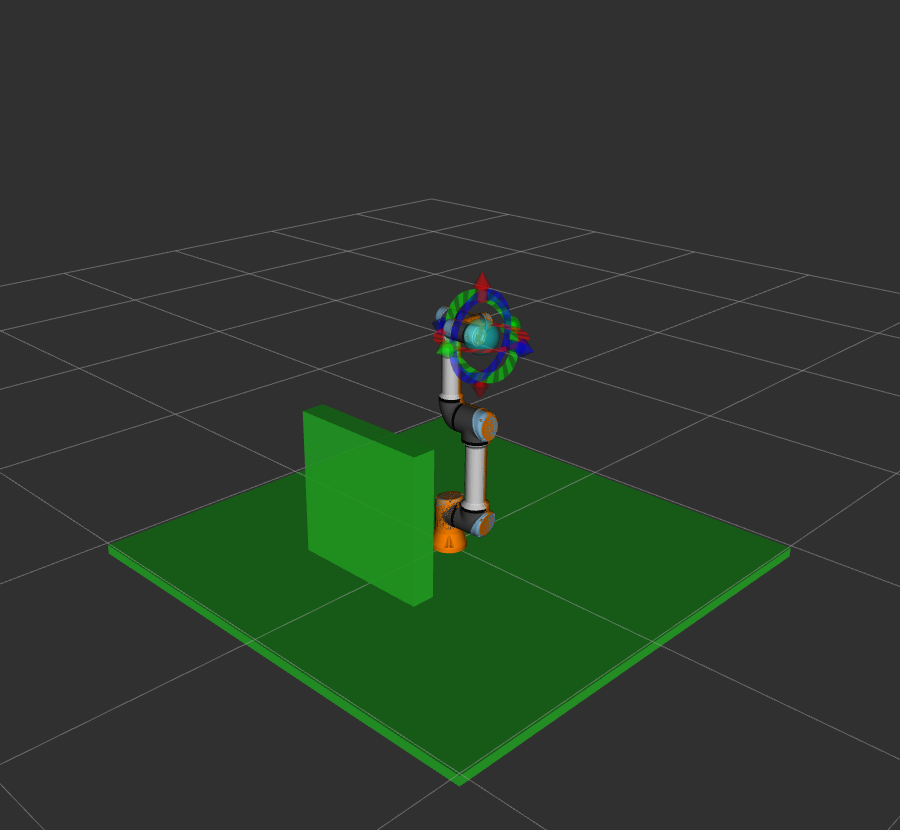</td>
<td align="center" style="border: none;">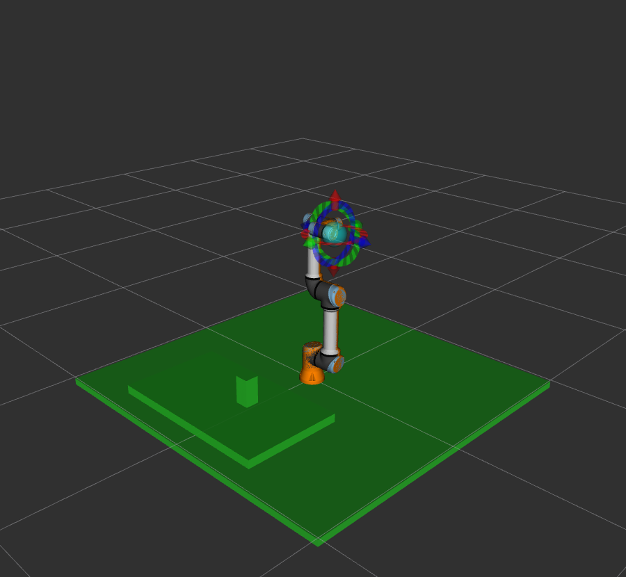</td>
</tr>
<tr style="border: none;">
<td align="center" style="border: none;"><b>shelf</b></td>
<td align="center" style="border: none;"><b>single_box</b></td>
<td align="center" style="border: none;"><b>table_pick</b></td>
</tr>
</table>


## 5. Testowane planery

Łącznie zestawiono **9 planerów** w trzech grupach (`config/planners.yaml`):

| Grupa | Planery |
|---|---|
| **MoveIt (OMPL)** | `moveit:RRTConnect` · `moveit:RRT` · `moveit:RRTstar` · `moveit:PRM` · `moveit:BITstar` · `moveit:EST` · `moveit:KPIECE` |
| **cuRobo** | `curobo` |
| **Baseline** | `straightline` |

### 5.1. straightline (linia odniesienia)

Najprostsza, naiwna linia bazowa. Liczy **liniową interpolację w przestrzeni złączy** między
konfiguracją startową a docelową (30 punktów pośrednich) i sprawdza, czy tak wyznaczona
prosta ścieżka jest bezkolizyjna. Jest praktycznie natychmiastowa (czas planowania ustalony
na `1e-4 s`), nie wykonuje żadnego planowania ani omijania przeszkód — **sukces tylko wtedy,
gdy prosta między startem a celem jest wolna od kolizji**. Stanowi dolną granicę odniesienia:
pokazuje, jak często sam „strzał na wprost” by wystarczył i o ile realne planery muszą się od
niego oddalić, by przejść przez przeszkody.

### 5.2. cuRobo (planer optymalizacyjny, GPU)

cuRobo to akcelerowana na CUDA biblioteka generowania ruchu firmy NVIDIA. Jej rdzeń
`MotionGen` jest samodzielny (nie wymaga Isaac Sim ani ROS), co czyni go idealnym do
sprawiedliwego porównania: ładuje ten sam robot i ten sam świat (przetłumaczony z naszego
scenariusza) i planuje do tego samego celu, po czym jego trajektoria oceniana jest **tym
samym kodem metryk** co pozostałe planery. W odróżnieniu od planerów próbkujących OMPL
(geometryczna ścieżka, potem parametryzacja czasowa), cuRobo jest podejściem
**optymalizacyjnym** i zwraca od razu zoptymalizowaną, sparametryzowaną czasowo trajektorię.
Cele zadawane są w przestrzeni pozy (FK celu), a nie złączy. Wymaga karty NVIDIA + CUDA +
PyTorch i działa wyłącznie w kontenerze `curobo`; pierwsze planowanie (warmup: CUDA-graph /
JIT) jest odrzucane i nie wchodzi do pomiarów.


## 6. Konfiguracja eksperymentu

| Parametr | Wartość |
|---|---|
| Robot | UR5e (wszędzie, mock hardware) |
| Liczba zapytań (par start/cel) na mapę | **50** |
| Powtórzenia każdego zapytania | **3** |
| Maksymalny czas planowania (timeout) | **10 s** |
| Liczba map | 6 |
| Liczba planerów | 9 |
| **Łączna liczba zaplanowanych ścieżek** | **3240** |

Każde zapytanie planowane było 3 razy (różne ziarna), aby losowość planerów ujawniła się
jako rozrzut na wykresach. Większość algorytmów generowała rozwiązanie w bardzo krótkim
czasie. **RRT\*** — jako planer typu *star* (optymalizacyjny) — dąży do znalezienia ścieżki
optymalnej i z założenia wykorzystuje **cały** dostępny budżet czasu na poprawę rozwiązania,
stąd jego czas planowania równy jest niemal dokładnie timeoutowi (10 s) na wszystkich mapach.

---

<div style="page-break-after: always;"></div>

## 7. Metodyka i definicje metryk

### 7.1. Zasady sprawiedliwego porównania (Pipeline B)

1. **Identyczne problemy.** Jedna biblioteka scenariuszy definiuje świat; jeden zaziarniony
   generator tworzy bezkolizyjne zapytania start/cel. Ten sam seed -> identyczne zapytania
   dla każdego planera i obu potoków.
2. **Naturalne cele, ten sam punkt docelowy.** Każde zapytanie przechowuje `goal_joint`
   *oraz* odpowiadającą mu pozę FK `goal_pose`. Planer w przestrzeni złączy (OMPL) używa
   celu złączowego; planer w przestrzeni pozy (cuRobo) używa pozy — oba osiągają tę samą
   konfigurację.
3. **Adaptery emitują tylko trajektorie.** Żaden planer nie ocenia sam siebie. Wszystkie
   metryki liczone są później przez `metrics.py` z trajektorii + (wspólnego) świata +
   wspólnego modelu robota. Usuwa to odchylenia pomiarowe specyficzne dla frameworka.
4. **Warmup wykluczony.** Planery z `requires_warmup` (cuRobo: CUDA-graph/JIT) dostają jedno
   „rozgrzewkowe” planowanie, które jest wykonywane, ale nie rejestrowane.
5. **Powtórzenia.** Każde (scenariusz, zapytanie) planowane jest `runs` razy; losowość
   planerów ujawnia się jako rozrzut na wykresach.

### 7.2. Definicje metryk (`metrics.py`)

Niech trajektoria to punkty złączowe `q_0 … q_N`. Odległości są euklidesowe w przestrzeni
złączy, o ile nie zaznaczono inaczej. Pozycja efektora `p(q)` pochodzi z analitycznej FK UR.

- **success** — planer zgłosił poprawne rozwiązanie w czasie `timeout`.
- **planning_time_s** — czas zegarowy wokół wywołania `plan()` (stan ustalony; warmup
  wykluczony).
- **solve_time_s** — czas do pierwszego poprawnego rozwiązania (≤ planning_time_s).
- **joint_path_length** — `Σ ‖q_{i+1} − q_i‖₂` (rad).
- **cartesian_path_length** — `Σ ‖p(q_{i+1}) − p(q_i)‖₂` (m).
- **smoothness_geom** — `PathGeometric::smoothness` z OMPL: dla każdego wierzchołka
  wewnętrznego z sąsiednimi długościami segmentów `a, b` i cięciwą `c`, kąt zakrętu
  `θ = π − acos((a²+b²−c²)/2ab)`, wkład `(2θ/(a+b))²`, zsumowane.
  **0 = idealnie prosta; większa wartość = bardziej poszarpana.** (Ta sama definicja co w
  MoveIt/OMPL, więc porównywalna z gładkością Pipeline A.)
- **smoothness_jerk** — znormalizowany scałkowany kwadrat zrywu (tylko gdy obecne są czasy
  poszczególnych punktów; resampling do siatki jednorodnej, 3× różniczkowanie skończone).
  Opcjonalna/drugorzędna.
- **clearance** — minimum, po zagęszczonej ścieżce (kroki ≤ 0.1 rad), odległości sfer
  kolizyjnych ramienia od najbliższej powierzchni przeszkody (m). Większa = bezpieczniejsza;
  `+inf` gdy scenariusz nie ma przeszkód; `< 0` = penetracja.
- **num_waypoints**, **path_valid** (żadna zagęszczona konfiguracja nie penetruje
  przeszkody).

### 7.3. Model kolizji warstwy metryk

Samodzielny model analityczny: kinematyka prosta UR (DH) + zgrubna aproksymacja ruchomego
ramienia sferami (statyczna kolumna bazy jest wykluczona, by nigdy nie raportowała kolizji z
podłogą, do której jest przymocowana). Model jest celowo bez zależności (tylko numpy), aby
metryki działały offline. Jest to model prześwitu **względny**, nie certyfikowany detektor
kolizji. Dla certyfikowanej geometrii należałoby podstawić pinocchio + hpp-fcl na realnych
siatkach — `metrics.py` jest niezależny od modelu kryjącego się za interfejsem `RobotModel`.

### 7.4. Uwaga o znaczeniu „czasu planowania” i „długości ścieżki” między frameworkami

Planery OMPL zwracają ścieżkę *geometryczną* (potem parametryzowaną czasowo); cuRobo zwraca
*zoptymalizowaną, sparametryzowaną czasowo* trajektorię. Raportujemy czas planowania do
pierwszego poprawnego rozwiązania i liczymy wszystkie metryki geometryczne jednym kodem po
wspólnym zagęszczeniu. To standardowe, obronne porównanie; różnica w *filozofii* planera
(próbkowanie vs optymalizacja) jest częścią tego, co benchmark ujawnia, a nie błędem do
ukrycia.

---

<div style="page-break-after: always;"></div>

## 8. Wyniki

Łącznie zaplanowano **3240 ścieżek** (9 planerów × 6 map × 50 zapytań × 3 powtórzenia, z
warmupem cuRobo wykluczonym z pomiarów).

### 8.1. Wykresy zbiorcze

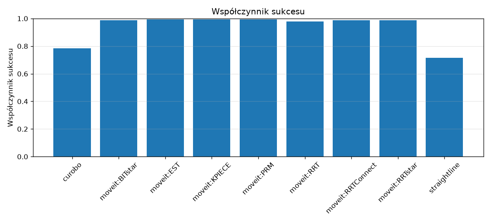

![Czas planowania [s]](results/report/plots/planning_time_s.png)

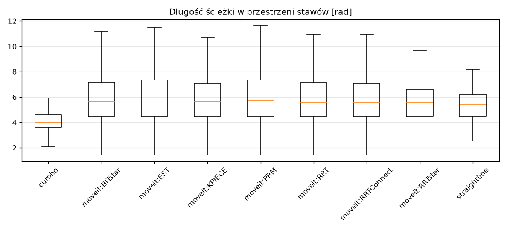

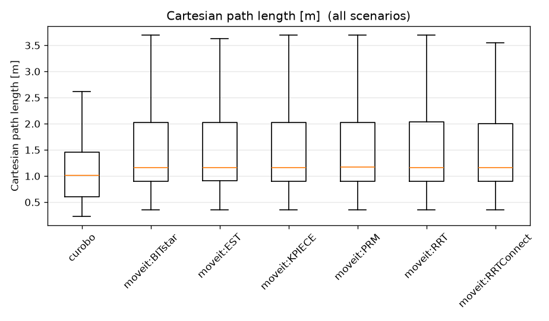

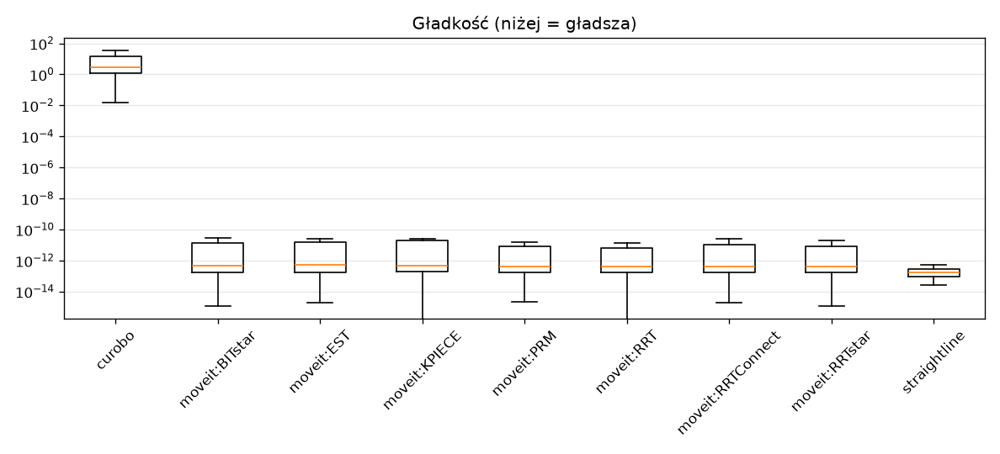

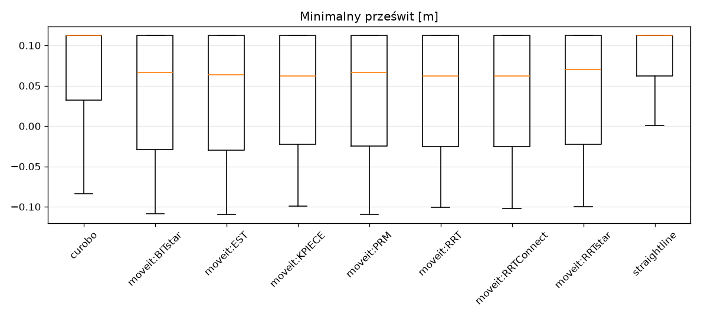

### 8.2. Omówienie

**Współczynnik sukcesu.** Planery OMPL osiągają bardzo wysoką skuteczność (≈0.95–1.00) na
wszystkich mapach. Baseline `straightline` zachowuje się zgodnie z oczekiwaniem dla naiwnej
prostej: niemal idealnie na `empty` (1.00) i `single_box` (0.85), ale gwałtownie spada na
mapach z gęstymi przeszkodami — `shelf` (0.30) i `cluttered` (0.60), `narrow_passage` (0.65).
To dobrze ilustruje, *kiedy* realne planowanie jest niezbędne. cuRobo ma niższą i bardziej
zróżnicowaną skuteczność (0.55–0.88), najniższą na trudnym geometrycznie `shelf` (0.55).

**Czas planowania.** Planery próbkujące rozwiązują problem w kilkadziesiąt milisekund
(mediana ≈0.01–0.04 s), cuRobo ≈0.05–0.07 s. Wyróżnia się **RRT\***: na *każdej* mapie jego
czas planowania to ≈10.0 s — czyli pełny timeout. To oczekiwane: jako planer
optymalizacyjny dąży do ścieżki optymalnej i z założenia zużywa cały dostępny budżet na
poprawę rozwiązania (kosztem czasu uzyskuje krótsze trajektorie).

**Długość ścieżki i gładkość.** Planery próbkujące OMPL dają w przestrzeni złączy ścieżki
zbliżonej długości; warianty optymalizacyjne (RRT\*, BITstar) skracają je względem czysto
feasiblowych. cuRobo konsekwentnie produkuje **najkrótsze** ścieżki w przestrzeni złączy
(np. `table_pick`: ≈3.63 vs ≈5.8 dla OMPL), co odzwierciedla jego naturę optymalizacyjną.
Gładkość geometryczna planerów OMPL jest bliska zeru (ścieżki gładkie po skróceniu), podczas
gdy cuRobo wykazuje wyraźnie wyższe wartości `smoothness_geom` — kompromis wynikający z innej
reprezentacji trajektorii.

**Prześwit (clearance).** Na `empty` prześwit jest niezdefiniowany (`+inf` — brak przeszkód).
Warto odnotować **ujemny** prześwit cuRobo na mapie `shelf` (mediana ≈ −0.009), co oznacza
penetrację względem zgrubnego, sferycznego modelu kolizji warstwy metryk — przy
interpretacji należy pamiętać, że jest to model **względny**, a nie certyfikowany detektor
kolizji (sekcja 7.3).

*Pełne dane liczbowe: `results/report/summary.csv` (agregaty) oraz `results/report/metrics.csv`
(surowe metryki per ścieżka).*

---

<div style="page-break-after: always;"></div>

## 9. Decyzje projektowe

| Decyzja | Domyślnie | Dlaczego |
|---|---|---|
| Dystrybucja ROS | Jazzy | MoveIt 2 + UR + benchmarki, **oraz** `moveit_py` jako binarka (`ros-jazzy-moveit-py`)|
| Robot | **ur5e wszędzie** | cuRobo dostarcza zwalidowany `ur5e.yml` a ur5 niestety nie; ur5e należy do rodziny UR5.  |
| Symulacja | Mock hardware | Planowanie potrzebuje tylko sceny planistycznej, nie fizyki; deterministyczne i szybkie |
| Interfejs MoveIt | `moveit_py` | In-process, dowolny pipeline/planer, zwraca pełną trajektorię; fallback MoveGroup udokumentowany |
| cuRobo | samodzielny `MotionGen` | Bez Isaac/ROS -> czysty, izolowany adapter |
| Backend metryk | analityczna FK UR + kolizje sferowe (numpy) | Testowalne offline; jednolite dla wszystkich planerów |

---

## 10. Dodatek — rozszerzanie i konfiguracja

### 10.1. Dodanie nowego planera

Kontrakt: podklasa `PlannerAdapter`, która zwraca **tylko trajektorie**; metryki liczą się
downstream tak samo dla każdego planera (zasada fairness). Wzór:
`adapters/template_adapter.py`.

Kroki:
1. Skopiuj `benchmark/mb_benchmark/adapters/template_adapter.py`
   -> `benchmark/mb_benchmark/adapters/<nazwa>_adapter.py`
2. Zaimplementuj:
   - `setup(robot_name, obstacles)` — zbuduj planner ze sceny. Ciężkie importy (ROS/torch)

   - `plan(query, timeout, seed, run) -> PlanResult` z `trajectory` (lista pozycji w
     przestrzeni złączy); ustaw `time_from_start` jeśli masz czasy; ustaw
     `requires_warmup = True` gdy GPU.
3. Na końcu pliku: `register("<nazwa>", lambda: <Twoj>Adapter())`
   (planery sparametryzowane, jak `moveit:`, rejestruje się w pętli — patrz
   `moveit_adapter.py:303`).
4. Dodaj import w `adapters/__init__.py`: `from . import <nazwa>_adapter`
5. (opcjonalnie) dopisz nazwę do grupy w `config/planners.yaml` -> `harness:` (np. pod
   `baselines:`), żeby leciała przez `@group` w `scripts/run_harness.sh`.

Sprawdzenie:
```bash
mb-benchmark list-planners            # Twoj planner na liscie (+ grupy z YAML)
mb-benchmark run --planners <nazwa> --out results
mb-benchmark run --planners @baselines --out results   # albo cala grupa z YAML
```

Konwencje: kwaterniony `[x,y,z,w]` w naszym kodzie; cuRobo używa `[w,x,y,z]` (konwertuj na
granicy). Domyślnie ur5e / Jazzy / mock hardware.

### 10.2. Skąd biorą się runs / timeout / lista planerów

Z pliku`config/planners.yaml` 

Nadpisanie na jedno uruchomienie:
```bash
RUNS=10 TIMEOUT=10 bash scripts/run_harness.sh
MOVEIT_PLANNERS=moveit:RRTConnect,moveit:RRT bash scripts/run_harness.sh
```
